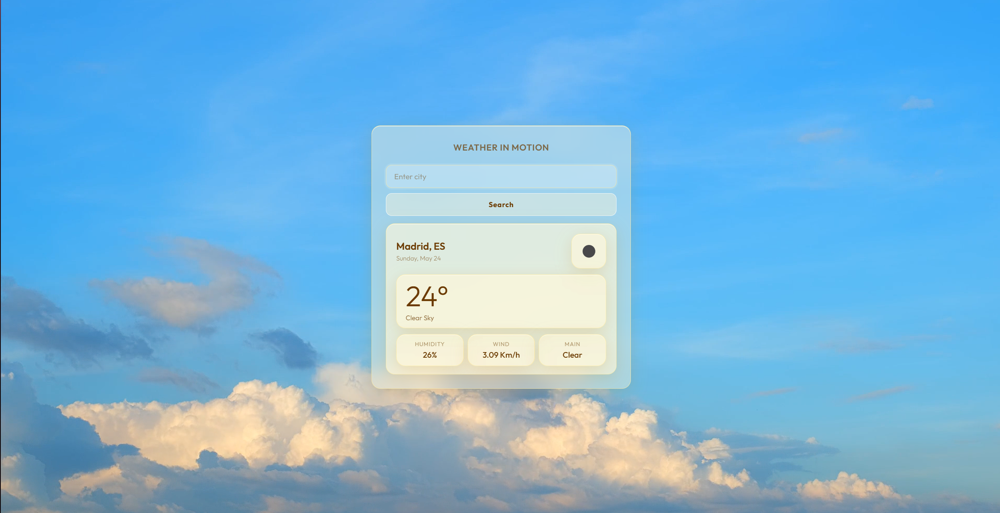
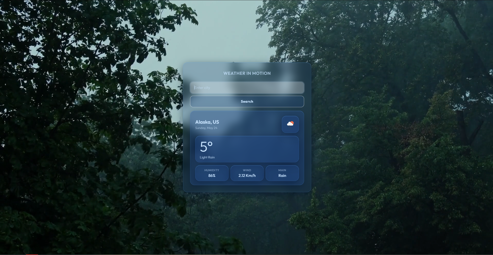
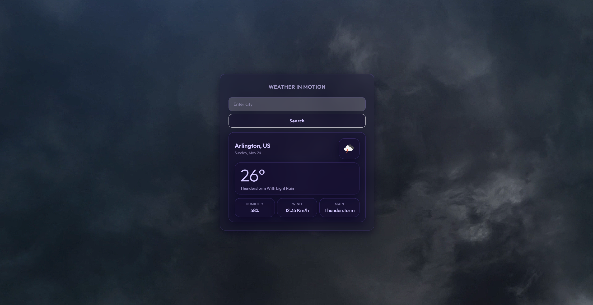
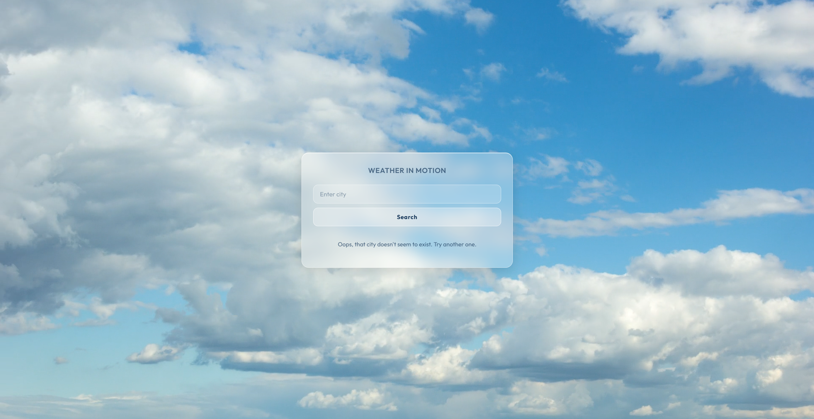
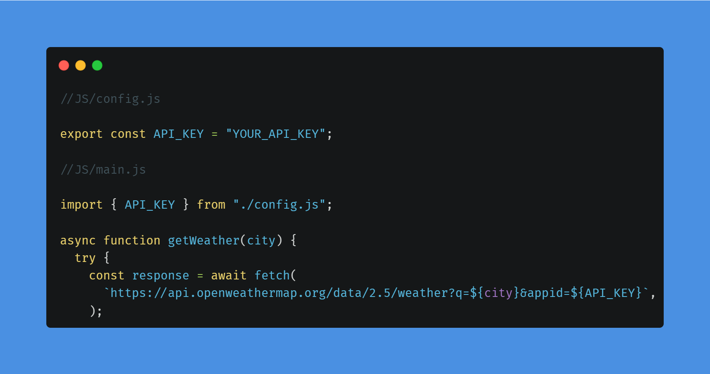
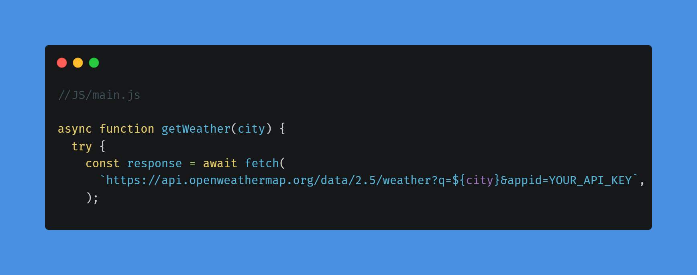

# 🌤️ Weather in Motion


A weather app that adapts its entire visual experience — glassmorphism UI, color palette, and background video — to match real-time weather conditions.

---

## Preview

| **Demo**
<video src="https://github.com/user-attachments/assets/1f3b5c7d-2b92-4651-8ab5-54794f175f2d" autoplay loop muted playsinline width="600"></video>

| Clear                                 | Rain                                | Thunderstorm                                        | Error handling                        |
| ------------------------------------- | ----------------------------------- | --------------------------------------------------- | ------------------------------------- |
|  |  |  |  |

---

## Live Demo

[Try it now!](https://weather-in-motion-git-main-glunmy-grims-projects.vercel.app)

---

## Features

- Search weather by city name
- Dynamic glassmorphism theme per weather condition
- Seamless background video transitions
- Keyboard support (Enter to search)
- Fully responsive design
- Smooth loading animation for polished UX

## Supported Weather Themes

| Condition                 | Theme             |
| ------------------------- | ----------------- |
| Clear                     | Warm golden tones |
| Clouds                    | Cool blue-grey    |
| Rain / Drizzle            | Deep blue         |
| Thunderstorm              | Dark purple       |
| Snow                      | Soft icy white    |
| Mist / Fog / Haze / Smoke | Muted green-grey  |

## Tech Stack

- Vanilla HTML, CSS, JavaScript (ES Modules)
- [OpenWeatherMap API](https://openweathermap.org/api)
- [Outfit Font](https://fonts.google.com/specimen/Outfit) — Google Fonts

## Project Structure

```text
weather-in-motion/
├── index.html
├── Style/
│   └── styles.css
├── JS/
│   ├── main.js
│   ├── Ui.js
│   └── utils.js
├── img/
│   ├── Favicon/
│   └── *.mp4 / *.mov
└── assets/
    ├── Weather-App-test.gif
    ├── screenshot-clear.png
    ├── screenshot-rain.png
    └── screenshot-thunderstorm.png
```

## Getting Started

### 1. Clone the repository

```bash
git clone https://github.com/tu-usuario/weather-in-motion.git
```

---

### 2. Get an API key

Create a free account and get your API key from:  
[OpenWeatherMap API](https://openweathermap.org/api)

---

### 3. Add your API key

You have two options:

#### Option A (Recommended): Using a config file

Create a file inside the `JS/` folder called `config.js`:

```js
export const API_KEY = "YOUR_API_KEY";
```

Then import it in `JS/main.js`.



---

#### Option B: Direct replacement

Replace the placeholder directly in `JS/main.js`:



---

### 4. Run the project

Open `index.html` using a local server (for example, Live Server):

👉 https://marketplace.visualstudio.com/items?itemName=ritwickdey.LiveServer

> ⚠️ This project requires a local server because it uses ES Modules.

```

## Future Improvements

- Auto-detect user location
- 5-day forecast
- Theme audio ambience
- Better visual error handling
- Persistent recent-search history
- City autocomplete suggestions

## License

[MIT](LICENSE) — feel free to use, modify and distribute.
```
